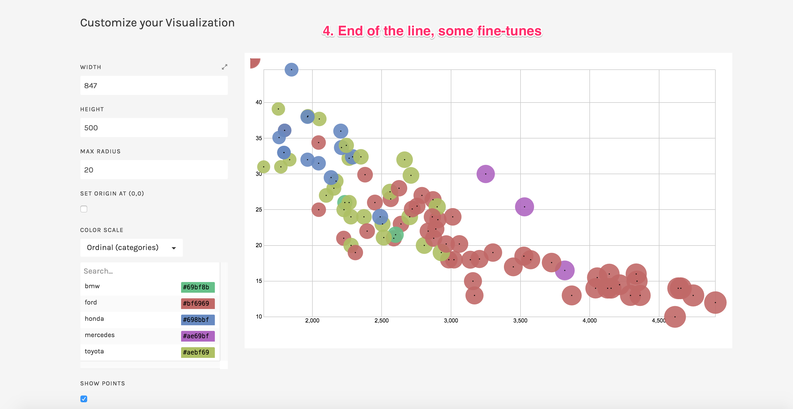

# 02-DataVis-10ways

# 1. Highcharts 
	Language: Javascript

Highcharts is a high-level charting library for Javascript. For a fairly lightweight size it offers built-in chart generation for web pages. More about Highcharts [here](http://www.highcharts.com/docs). This vis was built from scratch with references to the docs on that site.

To visualize the dataset, the first step was to import and parse the .csv file into a desirable data structure. Then I built up a canvas on HTML, and used Highcharts.chart({options}) to invoke the chart maker, the rest is just some configuration on functionality and ascetics.

Highcharts provides a default mouse over function, which is very nice and responsive.

One thing I really don't like about it is that this API automatically generates a watermark on the bottom right of the chart. There's no getting rid of it, which is annoying.

# 2. chart.js
	Language: Javascript

Like Highcharts, chart.js is also a charting library for Javascript. The structure and syntax of chart.js bears some resemblance to Highcharts. This vis was built from scratch with references to the docs and demos on [this site](http://www.highcharts.com/docs).

Visualization of the dataset required importing and parsing first. Then set up the canvas to render the chart. Next I created the chart object with Chart(canvas,{options}). Finally the chart is completed with some tweaks of the options input.

chart.js provides a default mouse over function, compared to Highcharts it is a little clumsy however.

# 3. d3
	Language: Javascript

Yet another Javascript library for producing data visualizations. This vis is inspired by and built on [this demo](http://bl.ocks.org/weiglemc/6185069). I will provide a brief comparison between d3 and the aboved two in the section below.

Using d3 to visualize data also required importing and parsing. In this case d3.csv(url,funcion()) was used. This is followed by setting up of canvas svg, then add data-assigned shapes to it by svg.append() and some configurations on properties.

# A brief talk of d3, Highcharts and chart.js. 

Among the three Javascript libraries I used, I definitly favor d3 over the other two in terms of power and versatility, and the opposite, especially chart.js in terms of ease of use. 

Highcharts and chart.js share the same design philosophy, that they are all top-down APIs to generate charts as an integrated whole. Compared to d3, they can generate charts in a more timely and, in hands of amateurs, elegant fashion, tweaking the options of the charts is also very easy. In short, these libraries are chart-centric, that is the chart exists independently from the data. Between them, chart.js is more featherweight and agile, while Highchart is more commercial and provides more functionalities with variants such as Highstock and Highmaps.

However, d3 is bottom-up, which focused on a lower level than those two. The user needs to put manually all the objects and shapes onto the canvas. This actually allows way more freedom to d3. Because it is data-centric instead of chart-centric, the user doesn't get to choose which type of chart he/she wants to use, he is actually building the chart from the bottom. This opens the option to build the visualization beyond the limitation of charts, thus some beautiful arts back in assignment 1.

# 4. Matlab plot
	Language: Matlab

Matlab is both a programming language and an environment expertised in the computing domain, which is more for mathematics and less for statistics. Therefore it has powerful plotting toolbox, but only limits to some traditional chart types.

For this visualization, I used a script to dismantle the cars-sample.csv into five sub csv files. Then I loaded them up in Matlab into five matrices with csvread(url). Next used scatter(x,y,r,c) to plot, finished with axis(), xlabel(), ylabel() and alpha() to meet the requirements. 

Writing up a .m script to plot is very simple and sraightforward. This is the 2nd easiest script I used here.

# 5. Tableau
	Language: None

Tableau is a data visualization tool written primarily in C++. The process is illustrated below. This is such a powerful tool, and my trial period is over :`(

And the result is:

# 6. Numbers
	Language: None

Mac Numbers is the counterpart statistics tool to Microsoft Excel. It is both straightforward and clumsy to use.

One thing that Mac Numbers does really bad is the axis ticks. You actually can't set ticks arbitarily, instead you need to give a range and a number of steps to let the app divide up the axis for you.

Size of the bubble is also relative, you can't set an absolute size for each bubble. By default the bubbles will be very large, so I had to set an invalid value with huge size to offset that.

# 7. matplotlib + pandas
	Language: Python

Python is a high-level programming language that started as a script language. 
Matplotlib is a plotting library under the plotly family, it provides O-O API for python and makes plotting charts much easier. 
Pandas is a data analysis library for python, I used it here to simplify importing and parsing the csv file.

First, I called pd.read_csv(url) to import and transform the data into an organised dictionary. Then I used plt.scatter(x,y,s,a,c,lw,label) to visualize the data. Finished with plt.title(), plt.xlabel(), plt.ylable(), plt.gca() to fine-tune the chart.

To me, the syntax structure reminds me a lot of that of Matlab. Maybe it's not that shocking considering that the library plotly it based upon has a Matlab API.

# 8. ggvis
	Language: R

R is THE language for statistical computing.
ggvis is data visualization package for R. The syntax is a little obscure and arbitrary at the first glance. But when I managed to understand it, it turned the creation of data visualizations into a walk in the park. This beats Matlab as the easiest script I wrote here.

First I used regular R grammar read.csv(url) and na.omit() to import data and get rid of null values. Then everything is done in basically one function, ggvis(x,y,fill,size,opacity). It doesn't event need fine-tune. ggvis even generates legends automatically.

One minor nitpick is that, I think R only accepts absolute path for importing files.

# 9. SPSS
	Language: None, does have it's own syntax though

SPSS is a statistics tool powered by Java. It has this really retro style around its GUI, by that I mean it looks really uncharming and feels truly out of touch. 

I used the GUI in the first place. It was fairly simple and easy to understand.

Then I found out it doesn't provide size to data mapping(not in the GUI), and the color opacity option isn't working. I had to find out about the snytax behind the GUI, and use that to generate the chart. The syntax was quite ill-documented, and while I managed to meet all the requirements, the rigidness of this syntax still irked me a lot, as the ascetics are really hard to tune. For example the color category is fixed and you cannot change it, once the relative size is mapped it is impossible to change its absolute size.

So for me this vis doesn't have great color choice, and the sizes of the markers are too small. But I had tried everything with it, it just wouldn't budge.

# 10. RAW
	Language: None

[RAW](http://raw.densitydesign.org/) is a web App that generates charts automatically from input csv-styled texts. The app is ultra lean and gets things done in about 30 seconds. 

Result:

But there are many things lacking from it. For instance, there's no legend option, if you want anything close you can only get this:

Also, there's no axes labels, no color opacities. So I had to get the embedded svg, paste it into an HTML file, add labels manually, and use CSS to change opacity.

Final verdict: Only-for-noobs/10.